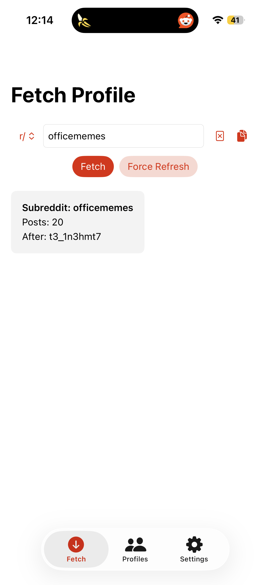
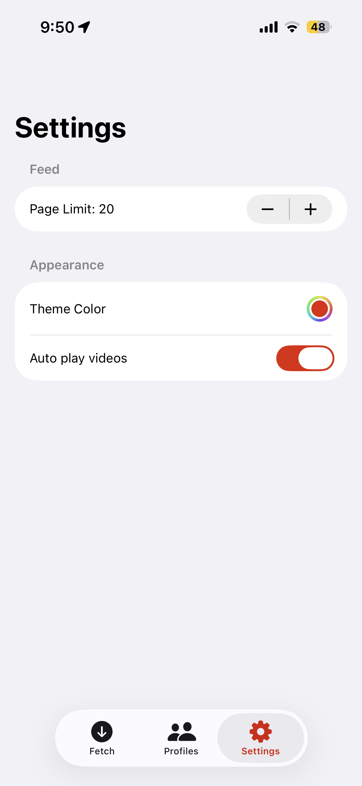

# 🐈 Reddit Kitty

**Reddit Kitty** is a premium, high-performance iOS application built with **SwiftUI** for seamless Reddit media consumption. It specializes in scraping and displaying images, galleries, and high-quality videos from subreddits and user profiles—**with no login or API keys required**—focusing on speed and aesthetic excellence.

<table>
<tr>
<td>
            
</td>
<td>

</td>
<td>
 
</td>
</tr>
</table>

---

## ✨ Key Features

### 📸 Advanced Media Scraping
- **Image Galleries**: Automatically extracts and displays multiple Hi-Res images from Reddit gallery posts.
- **High-Definition Video**: Supports HLS streaming and MP4 fallback for a smooth video playback experience.

### 🔄 Infinite Pagination
- Seamlessly scroll through thousands of posts with pagination. 
- Automatically fetches new content as you reach the end of the feed, ensuring a continuous browsing experience.

### 💾 Offline Caching (SwiftData)
- **Persistent Storage**: Save your favorite subreddits and user profiles for offline viewing.
- **Incremental Updates**: Intelligently caches new posts while maintaining your existing feed order.
- **Blazing Fast**: Loads previously fetched content instantly using SwiftData's  local storage.

### 📱 Premium Viewing Experience
- **Fluid Gestures**: Swipe to dismiss, pinch to zoom, and tap for an immersive full-screen view.
- **Media Downloader**: Save images and videos directly to your device.

### ⚙️ Settings
- **Themeing option very basic
- **Option to select page size for fetching posts
- **Option to enable disable autoplay for videos

---

## 🚀 Getting Started

*No Reddit login or API keys required to browse/scrape!*

1.  **Clone the Repository**:
    ```bash
    git clone https://github.com/akash/RedditKitty.git
    ```
2.  **Open in Xcode**:
    Navigate to the project folder and open `RedditKitty.xcodeproj`.
3.  **Run the App**:
    Select your target simulator or device and press `Cmd + R`.

---

## 📂 Project Structure

- **`Models/`**: Core data structures (`Post`, `MediaItem`) and the `PostsViewModel`.
- **`Views/`**: Modular SwiftUI components for browsing and viewing media.
- **`Services/`**: Networking and media processing logic (`MediaSequenceBuilder`, `NetworkManager`)

---

## 🖼️ Media Viewer Showcase

The `MediaViewerView` is the heart of Reddit Kitty, offering:
- **Interactive Paging**: Horizontal paging for a "magazine-like" feel.
- **Video Controls**: Auto-play options with smart gesture-based pausing.
- **Action Suite**: Quick access to download. (share and metadata WIP)

---

*Made with ❤️ for Reddit enthusiasts.*
